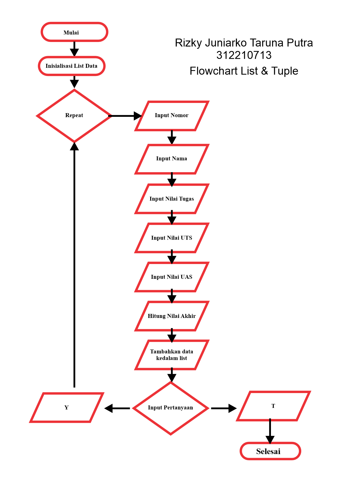
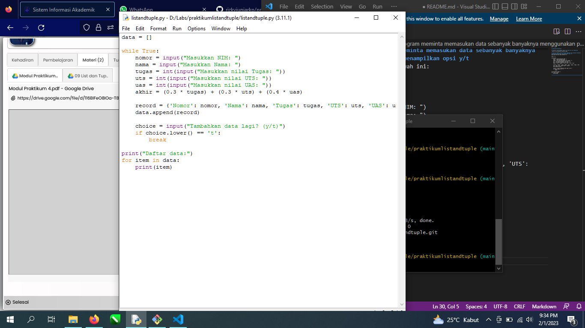

# praktikumlistandtuple

# Flowchart untuk membuat table list nama dan nilai mahasiswa

# Tutorial membuat program meminta memasukan data sebanyak banyaknya menggunakan perulangan, dan menampilkan opsi y/t
Buka aplikasi idle phyton buat file baru lalu mem Paste-kan kode dibawah ini:

data = []

while True:
nomor = input("Masukkan NIM: ")
nama = input("Masukkan Nama: ")
tugas = int(input("Masukkan nilai Tugas: "))
uts = int(input("Masukkan nilai UTS: "))
uas = int(input("Masukkan nilai UAS: "))
akhir = (0.3 * tugas) + (0.3 * uts) + (0.4 * uas)
    
record = {'Nomor': nomor, 'Nama': nama, 'Tugas': tugas, 'UTS': uts, 'UAS': uas, 'Nilai Akhir': akhir}
data.append(record)
    
choice = input("Tambahkan data lagi? (y/t)")
if choice.lower() == 't':
break

print("Daftar data:")
for item in data:
print(item)

tampilannya seperti ini

jangan lupa untuk selalu men save agar bisa dijalankan

lalu klik run atau bisa menekan tombol F5

maka akan muncul menu untuk menginput data nya

